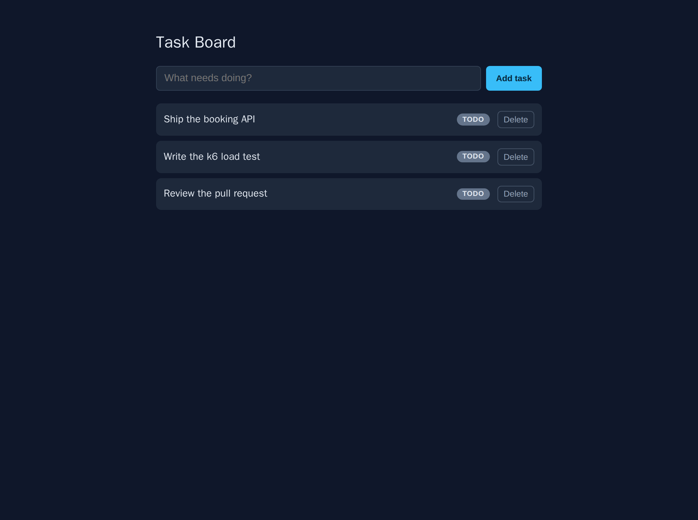
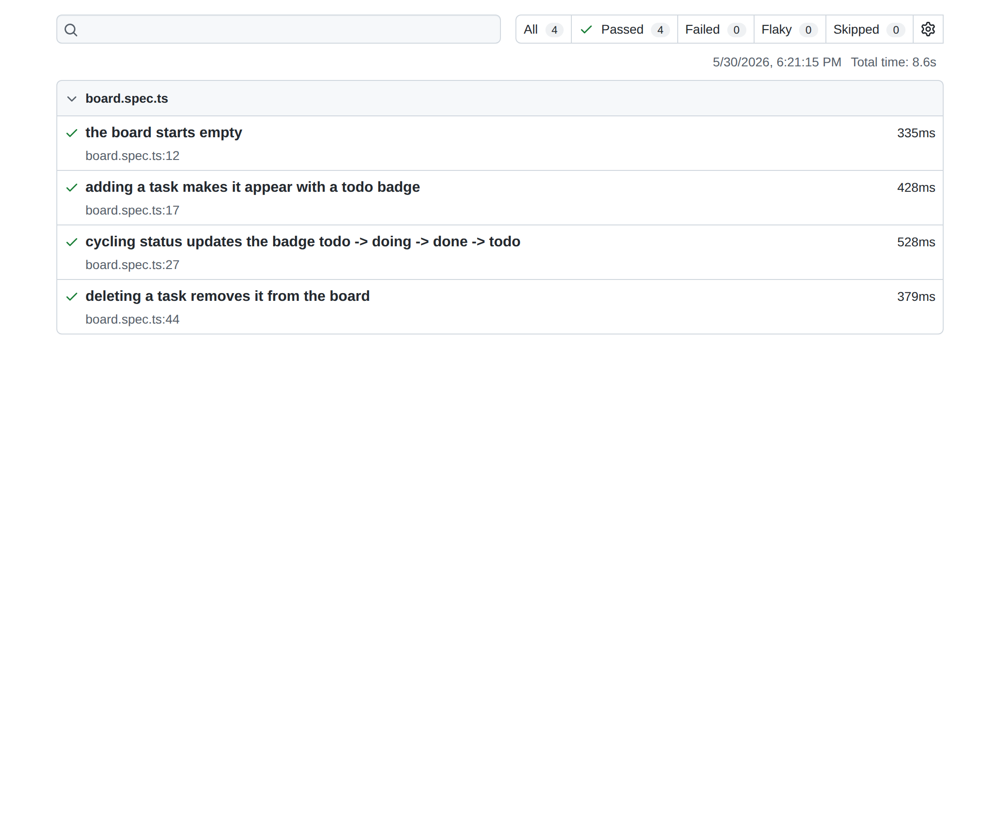

# Test Automation Showcase

A small but complete **test-automation portfolio**: a real system-under-test (SUT)
wrapped in a full **five-layer test pyramid**. The point of this repo is the tests —
the application exists to be tested in every meaningful way, from pure functions up
to a browser and a load generator, all runnable with a single Docker command per
layer.

[](https://github.com/peemphetpimolzzz/test-automation-showcase/actions/workflows/ci.yml)
[](LICENSE)

| Task Board (system under test) | Playwright report — all green |
|--------------------------------|-------------------------------|
|  |  |

## The system under test

A **Tasks API** (Node.js + TypeScript + Express) backed by **better-sqlite3**, plus a
dependency-free **Task Board** web page served by nginx.

- `GET /api/health` — liveness, returns `{ status, uptime }`.
- `GET /api/tasks` — list tasks (`{ tasks: [...] }`).
- `POST /api/tasks` — create a task (`{ title, status? }`).
- `GET /api/tasks/:id` — fetch one.
- `PATCH /api/tasks/:id` — update title and/or status.
- `DELETE /api/tasks/:id` — remove a task.
- `POST /api/_reset` — **test-only**, clears the store; gated by `ENABLE_TEST_RESET=1`.

Validation uses **zod** in strict mode (unknown keys rejected; `status ∈ {todo, doing, done}`).
Errors always use the envelope `{ "error": { "code", "message" } }`. The Express `app`
is exported without calling `listen`, so tests can drive it in-process with supertest.

The web page lets you add a task, see status badges, click a badge to cycle
`todo → doing → done → todo`, and delete tasks. nginx reverse-proxies `/api` to the
API so the browser uses a single origin (no CORS).

## The test pyramid

| Layer | Tool | What it covers | Runs against |
| --- | --- | --- | --- |
| **unit** | vitest | Pure domain logic (status cycle, title validation) + zod accept/reject | in-process, offline |
| **api / integration** | supertest | Every endpoint, status codes, 400 validation, 404s | in-process Express app, fresh `:memory:` DB per test |
| **contract** | zod response schemas | Each live response parses against its published schema | in-process Express app |
| **e2e** | Playwright | A real browser drives the board: add, cycle badge, delete | full Docker stack (web + api) |
| **load** | k6 | Smoke load with thresholds | API over the compose network |

## Running it

Everything runs in Docker. No local Node, k6, or browsers required.

```sh
cp .env.example .env

# Bring up the stack (API on :8090, web on :8091 by default)
docker compose up -d --build

# Try it
curl http://localhost:8090/api/health
curl -X POST http://localhost:8090/api/tasks -H 'Content-Type: application/json' -d '{"title":"Read the README"}'
curl http://localhost:8090/api/tasks
# open http://localhost:8091 in a browser
```

Each test layer runs via the test overlay:

```sh
# Unit tests (offline, reuses the SUT build image)
docker compose -f docker-compose.yml -f docker-compose.test.yml run --rm unit

# API + contract tests (offline, fresh in-memory DB per test)
docker compose -f docker-compose.yml -f docker-compose.test.yml run --rm apitest

# End-to-end (needs the stack up: docker compose up -d --build)
docker compose -f docker-compose.yml -f docker-compose.test.yml run --rm e2e

# Smoke load test (needs the stack up)
docker compose -f docker-compose.yml -f docker-compose.test.yml run --rm k6

# Tear down
docker compose down -v
```

The Playwright HTML report lands in `e2e/playwright-report/`; the k6 metrics summary
in `load/k6-summary.json`. See [`load/thresholds.md`](load/thresholds.md) for the
load profile and threshold rationale.

## Notes on the Docker setup

- **Uncommon host ports** (API `8090`, web `8091`) avoid clashes with common local
  services; both are env-overridable. SQLite means there is no database port.
- The SUT image is **multi-stage**: `better-sqlite3` is a native addon, so it is
  compiled in a `node:22-bookworm-slim` build stage that carries the toolchain; the
  runtime stage ships only production dependencies as a non-root user.
- Unit and API tests **reuse the build stage** (devDependencies and sources present)
  and run completely offline.
- Healthchecks are tuned per image: `node -e http.get(...)` for the slim API image
  (no `wget`), and a busybox-safe `wget -q -O /dev/null` for the nginx web image.

## CI

[`.github/workflows/ci.yml`](.github/workflows/ci.yml) runs unit and API tests in
parallel, then e2e and load against the built stack, uploading the Playwright report
and k6 summary as artifacts.

## License

MIT — see [LICENSE](LICENSE).
